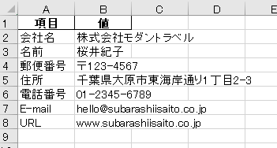

# Business Card OCR

EasyOCR と Roboflow を利用した名刺OCR自動分類システムです。
名刺画像から文字情報を抽出し、氏名・電話番号・メールアドレス・URL・住所を自動分類してExcelへ出力します。


## 機能

- 名刺画像からOCRを用いてテキスト抽出
- Roboflow Universe のAIモデルで物体検出
- 名前をbboxサイズから推定
- 電話番号 / メール / URL / 住所を自動分類
- Excel出力


## 使用モデル

Roboflow Universe:  
<https://universe.roboflow.com/first-9kwz3/business-card-sg7cv>


## 使用技術

- Python
- EasyOCR
- Roboflow
- pandas
- numpy
- re


## 実行方法

```bash
python business_card_ocr.py
```


## 実行結果

### 入力データ（名刺）


### Excel出力結果



## 工夫点

OCRの誤認識を考慮し、電話番号・郵便番号・URLなどは正規表現による自動補正を実装しました。
単純なOCR結果の出力ではなく、名刺に含まれる情報を項目ごとに分類してExcelへ整理することで、事務作業で活用しやすい形式で出力できるよう工夫しました。
検証用データが手元になかったため、Canvaを利用してサンプル名刺画像を作成し、OCR精度の確認を行いました。
